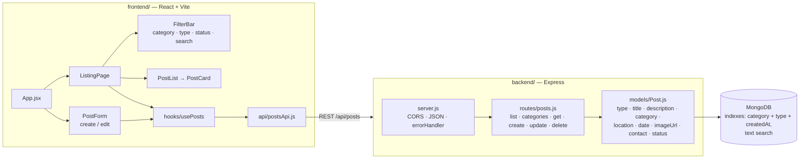

# Campus Lost & Found Portal (MERN)

Students can post items they've lost or found, browse all posts, and search by category or keyword.

- **Report:** [`report/Lost_and_Found_Portal_Report.pdf`](report/Lost_and_Found_Portal_Report.pdf) (10 pages; source: `report/report.html`)
- **Backend:** Node.js + Express + Mongoose (`backend/`)
- **Frontend:** React + Vite (`frontend/`)

## Features

- Post **lost** or **found** items with a title, description, category, location, date, an optional image URL and contact details
- Browse all posts, filter by category, type or status, and search by keyword, with pagination
- See category counts of open posts
- Mark a post **resolved** once the item is returned, edit it, or delete it
- A seed script loads realistic sample data for demos

## Architecture



## Run locally

Requires Node.js 18+ and MongoDB (local or Atlas).

```bash
# Backend  → http://localhost:5050
cd backend
cp .env.example .env      # edit MONGO_URI if using Atlas
npm install
npm run seed              # optional: sample posts
npm start

# Frontend → http://localhost:5173  (new terminal)
cd frontend
npm install
npm run dev
```

> Port 5050 is used instead of 5000 because macOS reserves 5000 for AirPlay Receiver.

## API

| Method | Endpoint | Description |
|---|---|---|
| GET | `/api/posts?category=&type=&status=&q=&page=&limit=` | List / filter / search posts |
| GET | `/api/posts/categories` | Categories with open-post counts |
| GET | `/api/posts/:id` | Single post |
| POST | `/api/posts` | Create post |
| PUT | `/api/posts/:id` | Update post / mark resolved |
| DELETE | `/api/posts/:id` | Delete post |

## Rebuilding the report

The PDF is rendered from `report/report.html` with the locally installed Google Chrome.

```bash
cd report/tools
npm install
npm run screenshots   # needs MongoDB, backend and frontend running; run `npm run seed` first
npm run pdf           # fails if any page's content overflows its border
```
