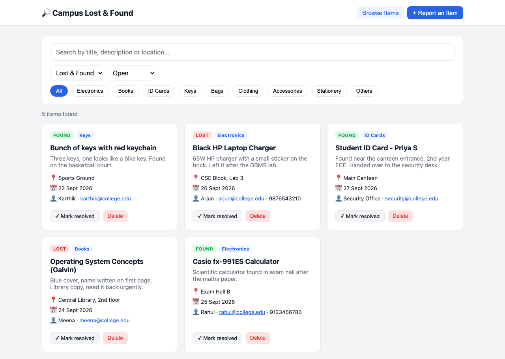
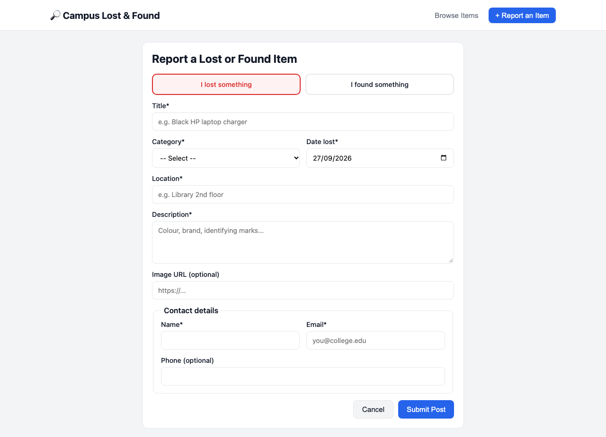

<div class="title-page">

# Campus Lost & Found Portal

## Project Report

**Full-Stack Web Application using MongoDB, Express.js, React and Node.js (MERN)**

<br>

| | |
|---|---|
| **Name** | ______________________ |
| **Register No.** | ______________________ |
| **Class / Section** | ______________________ |
| **Subject** | ______________________ |
| **Submitted to** | ______________________ |
| **Date** | ______________________ |

</div>

<div class="page-break"></div>

## Table of Contents

1. Introduction
2. Technology Stack
3. System Architecture
4. (a) MongoDB Schema Design
5. (b) Node.js API Routes
6. (c) React Component Structure & State Management
7. (d) Complete Data Flow
8. Testing
9. Output Screenshots
10. Project Structure & How to Run
11. Future Enhancements
12. Conclusion

<div class="page-break"></div>

## 1. Introduction

### 1.1 Problem Statement

Students often lose items on campus, such as ID cards, calculators, chargers, books and keys. Today these are usually reported on WhatsApp groups or notice boards, where posts get buried and are hard to search. The college needs a central **Lost and Found portal** where students can:

- **Post** an item they have **lost** or **found**
- **View** all posts in one place
- **Search** posts by **category** (electronics, books, ID cards, etc.) and by keyword
- **Update** a post (for example, mark it *resolved* once the item is returned) or **delete** it

### 1.2 Objectives

1. Design a MongoDB schema for storing lost/found posts.
2. Build a REST API in Node.js/Express that supports GET, POST, PUT and DELETE.
3. Build a React front end with a posting form and a searchable listing page.
4. Explain the complete data flow from the moment a user submits a post until it appears in the listing.

## 2. Technology Stack

| Layer | Technology | Purpose |
|---|---|---|
| Database | **MongoDB** | Stores posts as JSON-like documents |
| ODM | **Mongoose** | Defines the schema, runs validation and builds queries |
| Backend | **Node.js + Express.js** | REST API server |
| Frontend | **React 18 (Vite)** | Single-page user interface |
| Communication | **HTTP + JSON (Fetch API)** | Client–server data exchange |
| Tools | npm, VS Code, Chrome DevTools, curl | Development and testing |

## 3. System Architecture

The application follows a **three-tier architecture**:

```text
┌──────────────────────┐   HTTP/JSON    ┌──────────────────────┐   Mongoose   ┌──────────────────┐
│   PRESENTATION TIER  │  ───────────▶  │   APPLICATION TIER   │  ─────────▶  │    DATA TIER     │
│                      │                │                      │              │                  │
│   React (browser)    │  GET/POST/     │  Node.js + Express   │  find(),     │    MongoDB       │
│  - PostForm          │  PUT/DELETE    │  - routes/posts.js   │  create(),   │  lost_and_found  │
│  - ListingPage       │  /api/posts    │  - validation        │  update...   │  └─ posts        │
│  - usePosts (state)  │  ◀───────────  │  - error handling    │  ◀─────────  │     collection   │
└──────────────────────┘   JSON reply   └──────────────────────┘   documents  └──────────────────┘
      localhost:5173                          localhost:5050                     localhost:27017
```

<div class="page-break"></div>

## 4. (a) MongoDB Schema Design

### 4.1 Design Decisions

| Decision | Reason |
|---|---|
| **One `posts` collection** for both lost and found items, told apart by a `type` field | Both kinds of post have the same fields. One collection makes "view all posts" a single query, and lost/found becomes just another filter. |
| **`category` stored as an enum string** | Categories are fixed and few in number. An enum stops invalid values, and the category can be read without a join or `$lookup`. |
| **`contact` embedded** as a sub-document | Contact details are always shown together with the post and are never queried on their own, so embedding is the right MongoDB pattern. |
| **`date` kept separate from `createdAt`** | `date` records when the item was lost or found; `createdAt` records when it was posted. Both are useful. |
| **`status` field (`open` / `resolved`)** | Returned items can be marked resolved instead of deleted, so the history is kept. |
| **`timestamps: true`** | Mongoose maintains `createdAt` and `updatedAt` automatically, which are used for "newest first" sorting. |

### 4.2 Collection: `posts`

| Field | Type | Required | Constraints / Notes |
|---|---|---|---|
| `_id` | ObjectId | auto | Primary key generated by MongoDB |
| `type` | String | ✔ | enum: `lost`, `found` |
| `title` | String | ✔ | 3–100 chars, trimmed |
| `description` | String | ✔ | max 1000 chars |
| `category` | String | ✔ | enum: `electronics`, `books`, `id-cards`, `keys`, `bags`, `clothing`, `accessories`, `stationery`, `others` |
| `location` | String | ✔ | e.g. "Central Library, 2nd floor" |
| `date` | Date | ✔ | Date lost/found; cannot be in the future |
| `imageUrl` | String | ✘ | Optional photo link |
| `contact.name` | String | ✔ | max 60 chars |
| `contact.email` | String | ✔ | valid email format, lower-cased |
| `contact.phone` | String | ✘ | 7–15 digits |
| `status` | String | auto | enum: `open` (default), `resolved` |
| `createdAt` | Date | auto | Added by `timestamps` |
| `updatedAt` | Date | auto | Added by `timestamps` |

### 4.3 Sample Document

```json
{
  "_id": "6ab942853cd841cf2f13e401",
  "type": "found",
  "title": "Casio fx-991ES Calculator",
  "description": "Scientific calculator found in exam hall after the maths paper.",
  "category": "electronics",
  "location": "Exam Hall B",
  "date": "2026-09-25T00:00:00.000Z",
  "contact": {
    "name": "Rahul",
    "email": "rahul@college.edu",
    "phone": "9123456780"
  },
  "status": "open",
  "createdAt": "2026-09-27T16:21:09.412Z",
  "updatedAt": "2026-09-27T16:21:09.412Z"
}
```

### 4.4 Mongoose Schema (`backend/models/Post.js`)

```js
const CATEGORIES = ['electronics', 'books', 'id-cards', 'keys', 'bags',
                    'clothing', 'accessories', 'stationery', 'others'];

const contactSchema = new mongoose.Schema({
  name:  { type: String, required: true, trim: true, maxlength: 60 },
  email: { type: String, required: true, lowercase: true,
           match: [/^\S+@\S+\.\S+$/, 'Please enter a valid email'] },
  phone: { type: String, match: [/^[0-9+\-\s]{7,15}$/, 'Invalid phone'] },
}, { _id: false });

const postSchema = new mongoose.Schema({
  type:        { type: String, enum: ['lost', 'found'], required: true },
  title:       { type: String, required: true, trim: true, minlength: 3, maxlength: 100 },
  description: { type: String, required: true, trim: true, maxlength: 1000 },
  category:    { type: String, enum: CATEGORIES, required: true },
  location:    { type: String, required: true, trim: true },
  date:        { type: Date, required: true,
                 validate: { validator: v => v.getTime() <= Date.now() + 86400000,
                             message: 'Date cannot be in the future' } },
  imageUrl:    { type: String, trim: true },
  contact:     { type: contactSchema, required: true },
  status:      { type: String, enum: ['open', 'resolved'], default: 'open' },
}, { timestamps: true });
```

### 4.5 Indexes

```js
// 1. Compound index – speeds up "filter by category/type, newest first"
postSchema.index({ category: 1, type: 1, createdAt: -1 });

// 2. Text index – supports keyword search over title, description, location
postSchema.index(
  { title: 'text', description: 'text', location: 'text' },
  { weights: { title: 5, location: 2, description: 1 } }
);
```

Without indexes, MongoDB has to scan every document for each category search (a **COLLSCAN**). With the compound index it jumps straight to the matching documents (an **IXSCAN**), which keeps the portal fast as posts pile up over the semesters.

<div class="page-break"></div>

## 5. (b) Node.js API Routes

Base URL: `http://localhost:5050/api`

### 5.1 Route Summary

| Method | Endpoint | Description | Success | Errors |
|---|---|---|---|---|
| **GET** | `/posts` | List posts, with filtering, search & pagination | 200 | 500 |
| **GET** | `/posts/categories` | List categories with count of open posts | 200 | 500 |
| **GET** | `/posts/:id` | Get a single post | 200 | 400, 404 |
| **POST** | `/posts` | Create a new lost/found post | 201 | 400 |
| **PUT** | `/posts/:id` | Update a post (edit details / mark resolved) | 200 | 400, 404 |
| **DELETE** | `/posts/:id` | Delete a post | 200 | 400, 404 |

### 5.2 Query Parameters for `GET /posts`

| Param | Example | Effect |
|---|---|---|
| `category` | `electronics` | Only posts in this category |
| `type` | `lost` / `found` | Only lost or only found items |
| `status` | `open` / `resolved` | Filter by status |
| `q` | `calculator` | Case-insensitive search in title, description, location |
| `page`, `limit` | `1`, `12` | Pagination (limit capped at 50) |

Example: `GET /api/posts?category=electronics&type=found&q=calc&page=1`

### 5.3 Request / Response Examples

**POST /api/posts**, request body:

```json
{
  "type": "lost",
  "title": "Blue water bottle",
  "description": "Milton 1L, has a sticker",
  "category": "others",
  "location": "Gym",
  "date": "2026-09-27",
  "contact": { "name": "Test", "email": "t@college.edu" }
}
```

Response `201 Created`:

```json
{
  "success": true,
  "data": {
    "_id": "6ab9429db703e415cb5d87cb",
    "type": "lost", "title": "Blue water bottle", "status": "open",
    "createdAt": "2026-09-27T16:21:49.017Z", "...": "..."
  }
}
```

Response `400 Bad Request` (validation failed):

```json
{
  "success": false,
  "message": "Validation failed",
  "errors": {
    "title": "Title must be at least 3 characters",
    "category": "Invalid category",
    "contact.email": "Please enter a valid email"
  }
}
```

**GET /api/posts?category=electronics**, response `200 OK`:

```json
{
  "success": true,
  "data": [ { "title": "Casio fx-991ES Calculator", "...": "..." },
            { "title": "Black HP Laptop Charger",  "...": "..." } ],
  "pagination": { "page": 1, "limit": 12, "total": 2, "pages": 1 }
}
```

### 5.4 Route Implementation (`backend/routes/posts.js`, key parts)

```js
// GET /api/posts – list with filters
router.get('/', async (req, res, next) => {
  try {
    const { category, type, status, q } = req.query;
    const page  = Math.max(parseInt(req.query.page) || 1, 1);
    const limit = Math.min(parseInt(req.query.limit) || 12, 50);

    const filter = {};
    if (category && category !== 'all') filter.category = category;
    if (type && type !== 'all')         filter.type = type;
    if (status && status !== 'all')     filter.status = status;
    if (q) {
      const rx = new RegExp(escapeRegex(q.trim()), 'i');
      filter.$or = [{ title: rx }, { description: rx }, { location: rx }];
    }

    const [posts, total] = await Promise.all([
      Post.find(filter).sort({ createdAt: -1 })
          .skip((page - 1) * limit).limit(limit).lean(),
      Post.countDocuments(filter),
    ]);
    res.json({ success: true, data: posts,
               pagination: { page, limit, total, pages: Math.ceil(total / limit) || 1 } });
  } catch (err) { next(err); }
});

// POST /api/posts – create
router.post('/', async (req, res, next) => {
  try {
    const data = pick(req.body, EDITABLE_FIELDS);  // whitelist fields
    delete data.status;                            // new posts are always "open"
    const post = await Post.create(data);          // schema validation runs here
    res.status(201).json({ success: true, data: post });
  } catch (err) { next(err); }
});

// PUT /api/posts/:id – update
router.put('/:id', async (req, res, next) => {
  try {
    const post = await Post.findByIdAndUpdate(req.params.id,
      pick(req.body, EDITABLE_FIELDS), { new: true, runValidators: true });
    if (!post) return res.status(404).json({ success: false, message: 'Post not found' });
    res.json({ success: true, data: post });
  } catch (err) { next(err); }
});

// DELETE /api/posts/:id – delete
router.delete('/:id', async (req, res, next) => {
  try {
    const post = await Post.findByIdAndDelete(req.params.id);
    if (!post) return res.status(404).json({ success: false, message: 'Post not found' });
    res.json({ success: true, message: 'Post deleted' });
  } catch (err) { next(err); }
});
```

### 5.5 Middleware & Error Handling

| Middleware | Role |
|---|---|
| `cors()` | Allows the React dev server (port 5173) to call the API |
| `express.json()` | Parses JSON request bodies into `req.body` |
| `notFound` | Returns 404 JSON for unknown routes |
| `errorHandler` | Converts Mongoose `ValidationError` into **400** with field-wise messages, `CastError` (bad ObjectId) into **400**, and anything else into **500** |

**Security measures:** fields are whitelisted (`pick`) so clients cannot overwrite `_id` or `createdAt`; user search text is escaped before it goes into a regex, which blocks regex injection; `limit` is capped at 50; and `runValidators: true` makes updates go through the same validation as new posts.

<div class="page-break"></div>

## 6. (c) React Component Structure & State Management

### 6.1 Component Tree

```text
App                              ← view state (browse/report), toast, usePosts()
├── Header                       ← navigation buttons
└── main
    ├── PostForm                 ← (view = "report") controlled form, local form state
    │
    └── ListingPage              ← (view = "browse") receives posts + actions as props
        ├── FilterBar            ← search box, type/status dropdowns, category chips
        ├── PostList             ← maps posts → cards, shows empty state
        │   └── PostCard  × N    ← one post: badges, details, Resolve / Delete buttons
        └── Pagination controls

usePosts()  (custom hook)        ← posts, filters, pagination, loading, error,
                                   createPost / updatePost / deletePost
postsApi    (service module)     ← fetch() wrapper for /api/posts
```

### 6.2 Component Responsibilities

| Component | Props In | Local State | Responsibility |
|---|---|---|---|
| `App` | – | `view`, `toast` | Root; switches between form and listing; owns `usePosts()` |
| `Header` | `view`, `onChangeView` | – | Navigation |
| `PostForm` | `onSubmit`, `onCancel` | `form`, `errors`, `submitting`, `serverError` | Controlled inputs, client validation, submit |
| `ListingPage` | posts, filters, pagination, actions | – | Arranges filters, list, pagination; handles resolve/delete |
| `FilterBar` | `filters`, `onChange` | – | Search & category/type/status filters |
| `PostList` | `posts`, `loading`, handlers | – | Renders grid of cards or empty message |
| `PostCard` | `post`, `onResolve`, `onDelete` | – | Displays a single post |

### 6.3 State Management Strategy

State is kept **as close as possible to where it is used** and lifted up only when siblings need to share it:

| State | Where it lives | Why |
|---|---|---|
| Form field values, form errors, submitting flag | `PostForm` (`useState`) | Only the form needs them |
| `posts`, `filters`, `pagination`, `loading`, `error` | `usePosts` hook, called in `App` | Shared by the listing and by the form (a new post must appear in the list) |
| Current view, toast message | `App` | Global UI state |

The custom hook **`usePosts`** acts as a small store. It keeps all server data and API calls in one place, so the components stay presentational and are easy to test. For an app this size, `useState` plus a custom hook is enough; **Redux or Context would be over-engineering**. If the app grew, for example with login and user profiles, the hook could be moved into a React Context provider or replaced by a library like React Query without changing the components.

### 6.4 Posting Form (`PostForm.jsx`, key parts)

```jsx
export default function PostForm({ onSubmit, onCancel }) {
  const [form, setForm]         = useState(EMPTY_FORM);   // controlled inputs
  const [errors, setErrors]     = useState({});
  const [submitting, setSubmitting] = useState(false);

  const handleChange = (e) => {
    const { name, value } = e.target;
    setForm(prev => ({ ...prev, [name]: value }));
  };

  const handleSubmit = async (e) => {
    e.preventDefault();
    const clientErrors = validate(form);           // instant feedback
    setErrors(clientErrors);
    if (Object.keys(clientErrors).length) return;

    setSubmitting(true);
    try {
      await onSubmit(toPayload(form));            // → App → usePosts.createPost
      setForm(EMPTY_FORM);
    } catch (err) {
      setErrors(mapServerErrors(err.fieldErrors)); // show server validation errors
    } finally {
      setSubmitting(false);
    }
  };
  ...
}
```

### 6.5 Listing State (`usePosts.js`, key parts)

```jsx
export function usePosts() {
  const [posts, setPosts]     = useState([]);
  const [filters, setFilters] = useState({ category: 'all', type: 'all',
                                           status: 'open', q: '' });
  const [loading, setLoading] = useState(false);

  const fetchPosts = useCallback(async () => {
    setLoading(true);
    const res = await postsApi.list({ ...filters, page });
    setPosts(res.data);
    setLoading(false);
  }, [filters, page]);

  // re-fetch when filters change (debounced 300 ms for the search box)
  useEffect(() => {
    const t = setTimeout(fetchPosts, 300);
    return () => clearTimeout(t);
  }, [fetchPosts]);

  const createPost = async (data) => {
    const res = await postsApi.create(data);
    setPosts(prev => [res.data, ...prev]);  // show immediately
    fetchPosts();                           // re-sync with server
  };
  ...
}
```

<div class="page-break"></div>

## 7. (d) Complete Data Flow

### 7.1 Creating a Post: Sequence Diagram

```text
 USER         PostForm           App / usePosts        postsApi        Express API        Mongoose/MongoDB
  │               │                    │                  │                  │                     │
  │ fills form    │                    │                  │                  │                     │
  │──────────────▶│ setForm() on       │                  │                  │                     │
  │               │ every keystroke    │                  │                  │                     │
  │ clicks Submit │                    │                  │                  │                     │
  │──────────────▶│ validate(form)     │                  │                  │                     │
  │               │ toPayload(form)    │                  │                  │                     │
  │               │── onSubmit(data) ─▶│ createPost(data) │                  │                     │
  │               │                    │─ create(data) ──▶│                  │                     │
  │               │                    │                  │ POST /api/posts  │                     │
  │               │                    │                  │ JSON body ──────▶│ cors, express.json  │
  │               │                    │                  │                  │ pick() whitelist    │
  │               │                    │                  │                  │── Post.create() ───▶│ validate
  │               │                    │                  │                  │                     │ insertOne
  │               │                    │                  │                  │◀── saved doc ───────│ +_id,dates
  │               │                    │                  │◀── 201 + JSON ───│                     │
  │               │                    │◀── res.data ─────│                  │                     │
  │               │                    │ setPosts([new,…])│                  │                     │
  │               │                    │ fetchPosts() ────┼─ GET /api/posts ▶│── Post.find() ─────▶│
  │               │                    │◀─────────────────┼──── 200 JSON ────│◀────────────────────│
  │               │◀─ resolved ────────│ setView('browse')│                  │                     │
  │ sees new post │                    │ toast "live!"    │                  │                     │
  │◀──────────────┼──── React re-renders ListingPage → PostList → PostCard   │                     │
```

### 7.2 Step-by-Step Explanation

**Stage 1: Frontend (React)**

1. The user clicks **"+ Report an Item"**. `App` sets `view = 'report'` and renders `PostForm`.
2. Every input is a **controlled component**: its `value` comes from `form` state, and each keystroke calls `handleChange`, which updates the state with `setForm`.
3. On **Submit**, `handleSubmit` calls `e.preventDefault()` to stop a page reload, then runs `validate(form)`. If a field is invalid, the errors show immediately and no request is sent.
4. `toPayload(form)` turns the flat form fields into the nested JSON the API expects (e.g. `contactName` → `contact.name`).
5. `PostForm` calls `onSubmit(payload)`, which runs `App.handleCreate`, which calls `usePosts.createPost`.
6. `postsApi.create()` sends the request with `fetch('/api/posts', { method: 'POST', headers: {'Content-Type': 'application/json'}, body: JSON.stringify(payload) })`.

**Stage 2: Backend (Node.js / Express)**

7. The request reaches Express on port 5050. In development, Vite's proxy forwards `/api` from 5173 to 5050.
8. The **`cors`** middleware checks the origin, and **`express.json()`** parses the body into `req.body`.
9. The router sends `POST /api/posts` to the create handler. The handler **whitelists** fields with `pick()` and removes `status`, so every new post starts as `open`.
10. The handler calls `Post.create(data)`.

**Stage 3: Database (Mongoose → MongoDB)**

11. **Mongoose validates** the document against the schema: required fields, enums, lengths, email format, and no future dates. If validation fails, it throws a `ValidationError`, which the `errorHandler` turns into a **400** response listing the errors per field. The form then shows those messages under the matching inputs.
12. If validation passes, Mongoose applies the defaults (`status: 'open'`) and the timestamps (`createdAt`, `updatedAt`), and MongoDB runs **`insertOne`**, which generates the `_id`. MongoDB also updates the collection's indexes.
13. The saved document comes back to Express, which replies **`201 Created`** with `{ success: true, data: post }`.

**Stage 4: Back to the Frontend**

14. `postsApi` sees `res.ok` and returns the parsed JSON to `createPost`.
15. `createPost` calls `setPosts(prev => [newPost, ...prev])`, an **optimistic prepend** that shows the post without waiting for another request. It then calls `fetchPosts()` to re-sync the list, counts and pagination with the database.
16. `App` switches `view` back to `'browse'` and shows the toast **"Your post is live!"**.
17. Because the `posts` state changed, **React re-renders** `ListingPage`, then `PostList`, then a new `PostCard`, and the post appears at the top of the listing.
18. Any other student who opens or refreshes the listing gets the new post from `GET /api/posts`, since it is now stored in MongoDB.

### 7.3 Search / Filter Flow

```text
User clicks "Books" chip
  → FilterBar calls onChange({ category: 'books' })
  → usePosts.updateFilters() → setFilters({...filters, category:'books'}), setPage(1)
  → useEffect detects the new filters → waits 300 ms (debounce) → fetchPosts()
  → GET /api/posts?category=books&status=open&page=1
  → Express builds { category: 'books', status: 'open' }
  → Post.find(filter).sort({createdAt:-1})   (uses the compound index)
  → 200 JSON { data: [...], pagination }
  → setPosts(data) → React re-renders the list
```

The same flow handles the keyword search box. The 300 ms debounce means typing "calculator" sends **one** request instead of ten.

### 7.4 Update and Delete Flow

- **Mark resolved:** `PostCard` → `ListingPage.handleResolve` → `updatePost(id, {status:'resolved'})` → **`PUT /api/posts/:id`** → `findByIdAndUpdate(..., {runValidators:true})` → the updated document is returned → the card is replaced in state.
- **Delete:** a confirmation dialog appears → `deletePost(id)` → **`DELETE /api/posts/:id`** → `findByIdAndDelete` → the post is removed from state with `posts.filter(...)`.

<div class="page-break"></div>

## 8. Testing

The API was tested with `curl` against a running server with sample data loaded. Actual results:

| # | Test Case | Request | Expected | Result |
|---|---|---|---|---|
| 1 | Filter by category | `GET /posts?category=electronics` | 2 electronics posts | ✅ Calculator, Charger returned |
| 2 | Keyword search (partial) | `GET /posts?q=calc` | Calculator post | ✅ `['Casio fx-991ES Calculator']` |
| 3 | Create valid post | `POST /posts` (valid body) | 201, `status: "open"` | ✅ 201, status forced to `open` even though `resolved` was sent |
| 4 | Create invalid post | `POST /posts` (bad type, short title, bad email…) | 400 with field errors | ✅ 400, 8 field-level messages |
| 5 | Mark resolved | `PUT /posts/:id {status:"resolved"}` | Updated doc | ✅ `status: "resolved"` |
| 6 | Category counts | `GET /posts/categories` | Counts per category | ✅ electronics 2, books 1, id-cards 1, keys 1 |
| 7 | Delete post | `DELETE /posts/:id` | 200 | ✅ "Post deleted" |
| 8 | Get deleted post | `GET /posts/:id` | 404 | ✅ 404 "Post not found" |
| 9 | Invalid ObjectId | `GET /posts/abc` | 400 | ✅ 400 "Invalid _id: abc" |
| 10 | Frontend build | `vite build` | No errors | ✅ Built successfully |

## 9. Output Screenshots

### 9.1 Listing Page with Search and Category Filters



### 9.2 Posting Form



<div class="page-break"></div>

## 10. Project Structure & How to Run

```text
lost-and-found-portal/
├── backend/
│   ├── models/Post.js              # Mongoose schema + indexes
│   ├── routes/posts.js             # GET / POST / PUT / DELETE routes
│   ├── middleware/errorHandler.js  # 404 + validation error handling
│   ├── server.js                   # Express app + MongoDB connection
│   ├── seed.js                     # Sample data
│   └── .env.example
├── frontend/
│   ├── src/
│   │   ├── api/postsApi.js         # fetch wrapper
│   │   ├── hooks/usePosts.js       # state management hook
│   │   ├── components/
│   │   │   ├── Header.jsx
│   │   │   ├── PostForm.jsx
│   │   │   ├── ListingPage.jsx
│   │   │   ├── FilterBar.jsx
│   │   │   ├── PostList.jsx
│   │   │   └── PostCard.jsx
│   │   ├── constants.js            # category list
│   │   ├── App.jsx
│   │   └── main.jsx
│   └── vite.config.js              # dev proxy /api → :5050
└── report/REPORT.md
```

**Steps to run:**

```bash
# 1. Start MongoDB (local install or MongoDB Atlas connection string in .env)
# 2. Backend
cd backend
cp .env.example .env
npm install
npm run seed        # optional sample data
npm start           # → http://localhost:5050

# 3. Frontend (new terminal)
cd frontend
npm install
npm run dev         # → http://localhost:5173
```

## 11. Future Enhancements

1. **Authentication:** log in with the college email (JWT or Google SSO), so that only the author of a post can edit or delete it.
2. **Image upload:** upload photos directly (Multer + Cloudinary/S3) instead of pasting an image URL.
3. **Smart matching:** when a "found" post is created, automatically suggest "lost" posts with the same category and similar keywords, and notify their owners by email.
4. **Admin panel:** let the security office moderate posts and archive old resolved ones.
5. **Auto-expiry:** use a MongoDB TTL index to archive posts older than one semester.
6. **Real-time updates:** use Socket.IO so new posts appear without a refresh.

## 12. Conclusion

The Campus Lost & Found Portal meets all four requirements:

- **(a)** A single, validated and indexed MongoDB `posts` collection, with an embedded contact sub-document and enum-based categories.
- **(b)** A RESTful Express API with GET (list, filter, search, paginate, get one), POST, PUT and DELETE routes, plus proper status codes and central error handling.
- **(c)** A modular React component tree. Form state is local to `PostForm`, and shared post data lives in the `usePosts` custom hook.
- **(d)** A clear end-to-end data flow: a controlled form, then `fetch`, then Express middleware, then Mongoose validation, then MongoDB insert, then a JSON response, then a React state update and re-render.

The project shows how the MERN stack's single language (JavaScript) and single data format (JSON) across all tiers make it quick to build a practical tool that solves a real campus problem.
